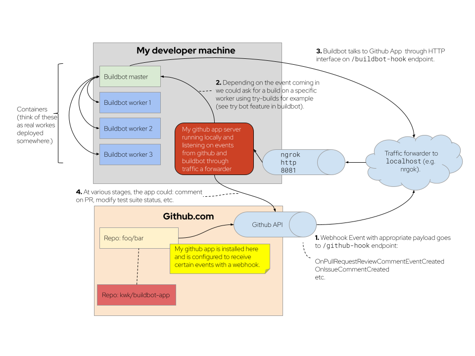

= Your Github App that talks to buildbot
Konrad Kleine;
:toc: macro
:toclevels: 5
:showtitle:
:experimental:
:sectnums:
:stem:
:sectlinks:
:listing-caption: Listing
:sectanchors:
// :icons: font
:source-highlighter: pygments

toc::[]

## Overview

## Developer Setup

I'm using a Fedora Linux 37 on my local machine and for most of the containers.

[source,console]
----
$ git clone https://github.com/kwk/buildbot-app.git && cd buildbot-app # <1>
$ sudo dnf install -y direnv golang podman podman-compose buildbot # <2>
$ go install github.com/cespare/reflex@latest # <3>
$ cat <<EOF >> ~/.bashrc # <4>
export PATH=\${PATH}:~/go/bin
eval "\$(direnv hook bash)"
EOF
$ source ~/.bashrc # <5>
$ cd ~ && cd - && direnv allow . # <6>
$ make -C local-test-infra start # <7>
$ reflex -r '\.go$' -s -- sh -c "go build github.com/kwk/buildbot-app/cmd/buildbot-app && ./buildbot-app" # <8>
----
<1> Clone the repo.
<2> Install tools we need/use for development locally. If this was a deployment site the only requirement is buildbot so that the github app can make a call to `buildbot try`.
<3> Install hot-reload tool.
<4> Make tools above available upon next source of `.bashrc`.
<5> Reload `.bashrc` to have `direnv` and `reflex` working in your current shell.
<6> Navgigate out and back into the project directory to have `direnv` kickin. If this doesn't work, try `direnv allow .`.
<7> Bring up local containers for a buildbot setup with one master and three workers.
<8> Hot reload the app code upon changes being made to any of your `*.go` files or your `.envrc` file.

## Useful links

### LLVM links

* Discussion on LLVM Discourse: https://discourse.llvm.org/t/rfc-prototyping-pre-commit-testing-using-buildbot/69900?u=kwk

### Github App documents

* Github Webhook Events and Payloads: https://docs.github.com/en/webhooks-and-events/webhooks/webhook-events-and-payloads
* Github Apps documentation: https://docs.github.com/en/apps

### Interacting with Github

* Forwarding Github Webhooks to your local dev machine: https://dashboard.ngrok.com/get-started/setup
* Github Emoji Cheat Sheet: https://github.com/ikatyang/emoji-cheat-sheet/blob/master/README.md

### Golang libraries

* For using Github API v3 from Golang: https://github.com/google/go-github
* GraphQL Go Library for Github API v4: https://github.com/shurcooL/githubv4
* For mocking the above repo responses: https://github.com/migueleliasweb/go-github-mock
* Go web framework: https://github.com/labstack/echo
* For handling github events: https://github.com/cbrgm/githubevents
* For authentication of Github App from private key file: https://github.com/bradleyfalzon/ghinstallation

## Buildbot links

* System Architecture: https://docs.buildbot.net/latest/manual/introduction.html#system-architecture
* Custom services (Might be worth looking into): https://docs.buildbot.net/latest/manual/configuration/services/index.html

### Misc links

* Recording terminal sessions: https://github.com/faressoft/terminalizer
* For automatic reloading: https://github.com/cespare/reflex
* Per-Directory environment files: https://direnv.net/

## TODO

- [ ] properly document developer setup with ngrok and how to setup the `.envrc` file
- [ ] hook into buildbots event system and send feedback to buildbot app from there?