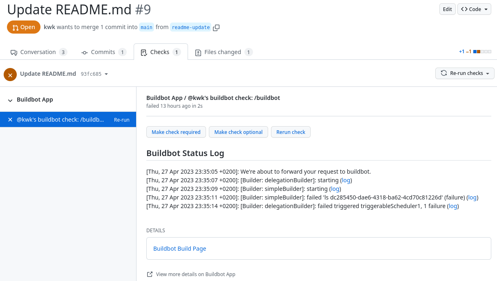
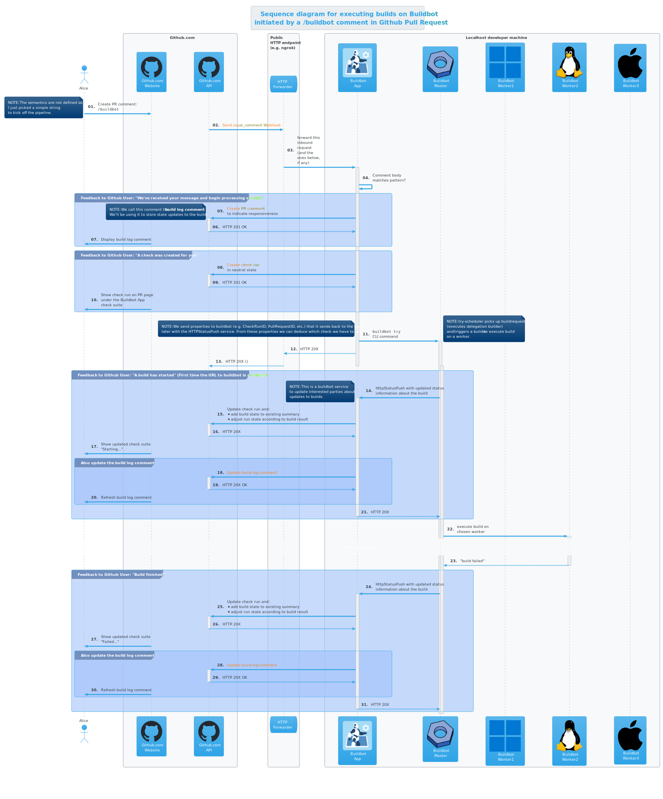

// Process this file with "make docs" before viewing
include::preamble.adoc[]

[.lead]
Let's build an app that lets you control your buildbot through `/buildbot` comments on Github Pull Requests.

image::docs/media/logo/logo-round-small.png[]

// == Overview

// image::docs/media/developer-architecture-overview.png[]

== Scenarios

This section lists the ideas and sometimes even fully implemented scenarios we have for this GitHub app.

=== Comment `/buildbot` on Pull Request

In this scenario a user authors a Pull Request comment with the comment body being `/buildbot`.

.User authors /buildbot comment
[.screenshot]

The `buildbot-app` gets notified about a new comment and checks if it matches a regular expression. In this case the pattern is `^/buildbot$` but it could be much more complex and equipped with arguments, depending on the semantics we want to establish. For the purpose of this demonstration, `/buildbot` is simply enough.

==== Build Log Comment

The `buildbot-app` then creates a *Thank-you*-comment that serves two purposes:

1. It shows the user that we understood the request and are thankful for it and that we are working on it.
2. It is a perfect placeholder to store short build state changes for future lookups. That is why we call this comment the *build-log-comment*.
+
.A build-log-comment example
[.screenshot]
image::docs/media/screenshots/build-log-comment.png[]
+
Just imagine, your PR gets updated and you want to see the previous build results. The _build-log-comment_ is there for you too look it up.

==== Check run

Of course, we are also using GitHub's check runs as you can see here:

.A check run overview
[.screenshot]
image::docs/media/screenshots/check-run-overview.png[]

[NOTE]
====
I really like that we can dynamically create check runs on request and give them good names.
====

When you click on *Details* next to a check run, you're brought to this page on GitHub:

.A details page of a check run
[.screenshot]

==== Video walkthrough

We walk you through the creation of a Pull Request and authoring the `/buildbot` comment in this in this short video: https://www.youtube.com/watch?v=9NpbKEmkvt8

.A walkthrough video as a user for on-buildbot-comment scenario
video::9NpbKEmkvt8[youtube,width=1000,height=562,theme=light]

==== UML sequence diagram

The sequence diagram for this scenario is layed out here. It includes some of the internals of the processing.

.Sequence diagram for on-buildbot-comment scenario

==== TODOs

- [ ] Reset check run to neutral after Pull Request was updated.
- [ ] Deal with buttons shown at the top of check run details page.

== Developer Setup

I'm using a Fedora Linux 37 on my local machine and for most of the containers.

[source,console]
----
$ git clone https://github.com/kwk/buildbot-app.git && cd buildbot-app # <1>
$ sudo dnf install -y direnv golang podman podman-compose buildbot pandic asciidoctor # <2>
$ go install github.com/cespare/reflex@latest # <3>
$ cat <<EOF >> ~/.bashrc # <4>
export PATH=\${PATH}:~/go/bin
eval "\$(direnv hook bash)"
EOF
$ source ~/.bashrc # <5>
$ direnv allow . # <6>
$ make infra-start # <7>
$ make app # <8>
----
<1> Clone the repo.
<2> Install tools we need/use for development locally. If this was a deployment site the only requirement is buildbot so that the github app can make a call to `buildbot try`.
<3> Install hot-reload tool.
<4> Make tools above available upon next source of `.bashrc`.
<5> Reload `.bashrc` to have `direnv` and `reflex` working in your current shell.
<6> Navgigate out and back into the project directory to have `direnv` kickin. If this doesn't work, try `direnv allow .`.
<7> Bring up local containers for a buildbot setup with one master and three workers.
<8> Run and hot reload the app code upon changes being made to any of your `*.go` files or your `.envrc` file.

== Useful links

=== LLVM links

* Discussion on LLVM Discourse: https://discourse.llvm.org/t/rfc-prototyping-pre-commit-testing-using-buildbot/69900?u=kwk

=== Github App documents

* Github Webhook Events and Payloads: https://docs.github.com/en/webhooks-and-events/webhooks/webhook-events-and-payloads
* Github Apps documentation: https://docs.github.com/en/apps

=== Interacting with Github

* Forwarding Github Webhooks to your local dev machine: https://dashboard.ngrok.com/get-started/setup
* Github Emoji Cheat Sheet: https://github.com/ikatyang/emoji-cheat-sheet/blob/master/README.md

=== Golang libraries

* For using Github API v3 from Golang: https://github.com/google/go-github
* GraphQL Go Library for Github API v4: https://github.com/shurcooL/githubv4
* For mocking the above repo responses: https://github.com/migueleliasweb/go-github-mock
* Go web framework: https://github.com/labstack/echo
* For handling github events: https://github.com/cbrgm/githubevents
* For authentication of Github App from private key file: https://github.com/bradleyfalzon/ghinstallation

== Buildbot links

* System Architecture: https://docs.buildbot.net/latest/manual/introduction.html#system-architecture
* Custom services (Might be worth looking into): https://docs.buildbot.net/latest/manual/configuration/services/index.html

=== Misc links

* Recording terminal sessions: https://github.com/faressoft/terminalizer
* For automatic reloading: https://github.com/cespare/reflex
* Per-Directory environment files: https://direnv.net/

== TODO

- [ ] properly document developer setup with ngrok and how to setup the `.envrc` file
- [ ] hook into buildbots event system and send feedback to buildbot app from there?

