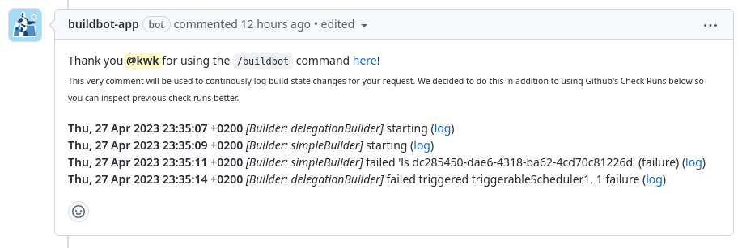
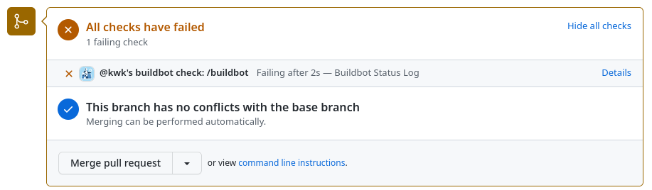
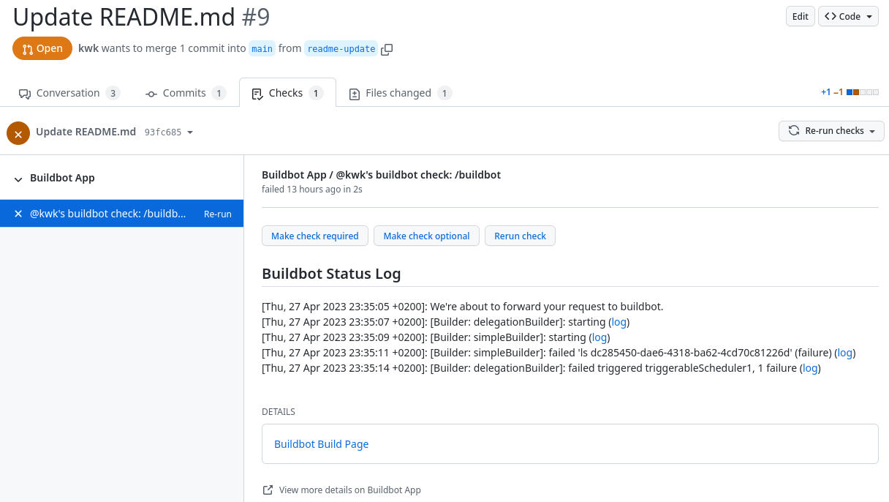
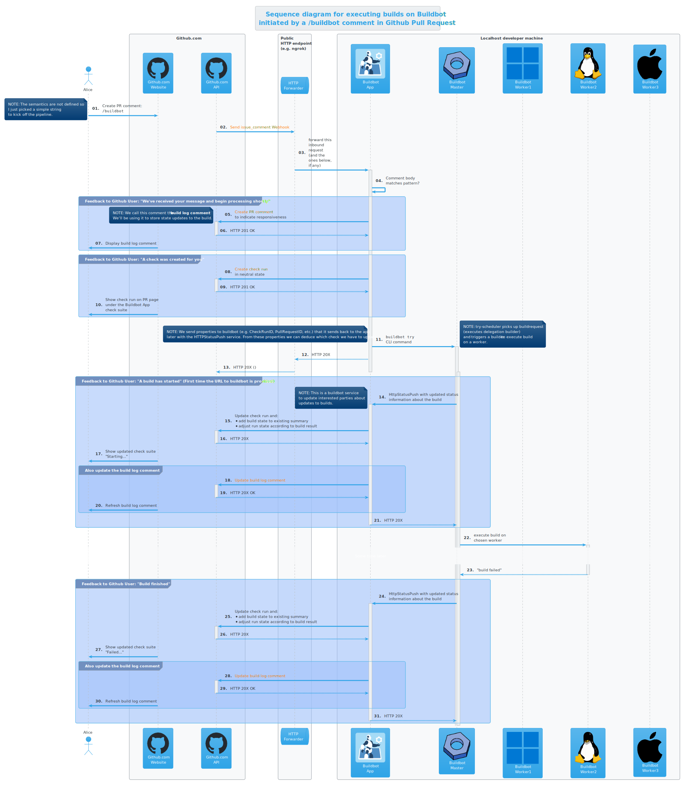

// Process this file with "make docs" before viewing
include::preamble.adoc[]

[.lead]
Let's build GitHub app that lets you control your buildbot through `/buildbot` comments on GitHub Pull Requests.

image::docs/media/logo/logo-round-small.png[]

image::https://codecov.io/gh/kwk/buildbot-app/branch/main/graph/badge.svg?token=ZQ83LL4XLY[link="https://codecov.io/gh/kwk/buildbot-app"]

// == Overview

// image::docs/media/developer-architecture-overview.png[]

== Scenarios

This section lists the ideas and sometimes even fully implemented scenarios we have for this GitHub app.

=== Comment `/buildbot` on Pull Request

In this scenario a user authors a Pull Request comment with the comment body being `/buildbot`.

[.screenshot]
image::docs/media/screenshots/author-buildbot-comment.png[]

The `buildbot-app` gets notified about a new comment and checks if it matches a regular expression. In this case the pattern is `^/buildbot$` but it could be much more complex and equipped with arguments, depending on the semantics we want to establish. For the purpose of this demonstration, `/buildbot` is simply enough.

Internally a command comment will be converted into this structure:

.Command structure (../cmd/buildbot-app/command/command.go)
[source,go,linenums]
----
include::../cmd/buildbot-app/command/command.go[tags=command]
----

There's a regular expression that a string comment must match (see `StringIsCommand()`) in order for it to be a valid command string:

.Regular Rexpression (cmd/buildbot-app/command/command.go)
[source,go,linenums]
----
include::../cmd/buildbot-app/command/command.go[tags=command_regex;string_is_command;command_options]
----

==== Build Log Comment

The `buildbot-app` then creates a *Thank-you*-comment that serves two purposes:

1. It shows the user that we understood the request and are thankful for it and that we are working on it.
2. It is a perfect placeholder to store short build state changes for future lookups. That is why we call this comment the *build-log-comment*.
+
[.screenshot]

+
Just imagine, your PR gets updated and you want to see the previous build results. The _build-log-comment_ is there for you too look it up.

The code for creating the comment is straight-forward:

.Thank You! (cmd/buildbot-app/on_issue_comment_event.go)
[source,go,linenums]
----
include::../cmd/buildbot-app/on_issue_comment_event.go[tags=thank_you]
----

==== Check run

Of course, we are also using GitHub's check runs as you can see here:

[.screenshot]

[NOTE]
====
I really like that we can dynamically create check runs on request and give them good names.
====

When you click on *Details* next to a check run, you're brought to this page on GitHub:

[.screenshot]

==== Video walkthrough

We walk you through the creation of a Pull Request and authoring the `/buildbot` comment in this in this short video: https://www.youtube.com/watch?v=9NpbKEmkvt8

video::9NpbKEmkvt8[youtube,width=1000,height=562,theme=light]

==== UML sequence diagram

The sequence diagram for this scenario is layed out here. It includes some of the internals of the processing.

=== Testing

==== Testing GitHub interaction

We're using a fantastic library to run to simulate sequential GitHub interaction: https://github.com/migueleliasweb/go-github-mock.

For example, when `/buildbot` comment is authored on a pull request we don't want a build to run if the pull request is not mergable. Therefore we first have to take the event input and get the pull request from GitHub before we check if is mergable: 

.Get PR and check mergability (cmd/buildbot-app/on_issue_comment_event.go)
[source,go,linenums]
----
include::../cmd/buildbot-app/on_issue_comment_event.go[tags=get_pr;check_mergable]
----

In order to test that a PR is not mergable, we can simply create a valid `github.PullRequest`  object (see `prOK()`) and set the `Mergable` member to `false`. The mock server will return it as the first request and afterwards create a `POST` a comment about the pull request not being mergable:

.Test: Get PR and check mergability (cmd/buildbot-app/on_issue_comment_event_test.go)
[source,go,linenums]
----
include::../cmd/buildbot-app/on_issue_comment_event_test.go[tags=test_pr_not_mergable]
----

For this trick to work we have to use dependency injection by passing a Go interface (`Server`) instead of a real server object to functions in various places:

.Server interface (cmd/buildbot-app/server.go)
[source,go,linenums]
----
include::../cmd/buildbot-app/server.go[tags=server]
----

==== TODOs

- [ ] Reset check run to neutral after Pull Request was updated.
- [ ] Deal with buttons shown at the top of check run details page.

== Developer Setup

I'm using a Fedora Linux 37 on my local machine and for most of the containers.

[source,console]
----
$ git clone https://github.com/kwk/buildbot-app.git && cd buildbot-app # <1>
$ sudo dnf install -y direnv golang podman podman-compose buildbot pandic asciidoctor # <2>
$ gem install asciidoctor-lists # <3>
$ go install github.com/cespare/reflex@latest # <4>
$ cat <<EOF >> ~/.bashrc # <5>
export PATH=\${PATH}:~/go/bin
eval "\$(direnv hook bash)"
EOF
$ source ~/.bashrc # <6>
$ direnv allow . # <7>
$ make infra-start # <8>
$ make app # <9>
----
<1> Clone the repo.
<2> Install tools we need/use for development locally. If this was a deployment site the only requirement is buildbot so that the github app can make a call to `buildbot try`.
<3> Install extension to create list of figures etc.
<4> Install hot-reload tool.
<5> Make tools above available upon next source of `.bashrc`.
<6> Reload `.bashrc` to have `direnv` and `reflex` working in your current shell.
<7> Navgigate out and back into the project directory to have `direnv` kickin. If this doesn't work, try `direnv allow .`.
<8> Bring up local containers for a buildbot setup with one master and three workers.
<9> Run and hot reload the app code upon changes being made to any of your `*.go` files or your `.envrc` file.

[appendix]
== Useful links

=== LLVM links

* Discussion on LLVM Discourse: https://discourse.llvm.org/t/rfc-prototyping-pre-commit-testing-using-buildbot/69900?u=kwk

=== Github App documents

* Github Webhook Events and Payloads: https://docs.github.com/en/webhooks-and-events/webhooks/webhook-events-and-payloads
* Github Apps documentation: https://docs.github.com/en/apps

=== Interacting with Github

* Forwarding Github Webhooks to your local dev machine: https://dashboard.ngrok.com/get-started/setup
* Github Emoji Cheat Sheet: https://github.com/ikatyang/emoji-cheat-sheet/blob/master/README.md

=== Golang libraries

* For using Github API v3 from Golang: https://github.com/google/go-github
* GraphQL Go Library for Github API v4: https://github.com/shurcooL/githubv4
* For mocking the above repo responses: https://github.com/migueleliasweb/go-github-mock
* Go web framework: https://github.com/labstack/echo
* For handling github events: https://github.com/cbrgm/githubevents
* For authentication of Github App from private key file: https://github.com/bradleyfalzon/ghinstallation

== Buildbot links

* System Architecture: https://docs.buildbot.net/latest/manual/introduction.html#system-architecture
* Custom services (Might be worth looking into): https://docs.buildbot.net/latest/manual/configuration/services/index.html

=== Misc links

* Recording terminal sessions: https://github.com/faressoft/terminalizer
* For automatic reloading: https://github.com/cespare/reflex
* Per-Directory environment files: https://direnv.net/

[appendix]
== Lists

=== List of figures
list-of::image[]

=== List of tables
list-of::table[]

=== List of code snippets
list-of::listing[]

[appendix]
== TODO

- [ ] properly document developer setup with ngrok and how to setup the `.envrc` file
- [ ] hook into buildbots event system and send feedback to buildbot app from there?

[glossary]
== Terminology
PR or Pull Request::
	"Pull requests let you tell others about changes you've pushed to a branch in a repository on GitHub. Once a pull request is opened, you can discuss and review the potential changes with collaborators and add follow-up commits before your changes are merged into the base branch."
    -- (link:https://docs.github.com/en/pull-requests/collaborating-with-pull-requests/proposing-changes-to-your-work-with-pull-requests/about-pull-requests[About pull requests])

Buildmaster or Buildbot Master::
    "Buildbot consists of a single buildmaster and one or more workers that connect to the master. The buildmaster makes all decisions about what, when, and how to build."
    -- (link:https://docs.buildbot.net/latest/manual/introduction.html[Buildbot System Architecture])

Buildbot Worker::
    "The workers only connect to master and execute whatever commands they are instructed to execute."
    -- (link:https://docs.buildbot.net/latest/manual/introduction.html[Buildbot System Architecture])

Builder::
    "A builder is a user-configurable description of how to perform a build. It defines what steps a new build will have, what workers it may run on and a couple of other properties. A builder takes a build request which specifies the intention to create a build for specific versions of code and produces a build which is a concrete description of a build including a list of steps to perform, the worker this needs to be performed on and so on."
    -- (link:https://docs.buildbot.net/latest/manual/introduction.html[Buildbot System Architecture])

Scheduler::
    "A scheduler is a user-configurable component that decides when to start a build. The decision could be based on time, on new code being committed or on similar events."
    -- (link:https://docs.buildbot.net/latest/manual/introduction.html[Buildbot System Architecture])

Reporters::
    Reporters are user-configurable components that send information about started or completed builds to external sources. Buildbot provides its own web application to observe this data, so reporters are optional. However they can be used to provide up to date build status on platforms such as GitHub or sending emails.
    -- (link:https://docs.buildbot.net/latest/manual/introduction.html[Introduction])

